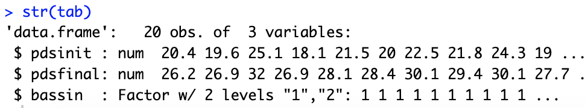

# TP Statistiques - Jules Ginhac

## 1. Lecteure des données

**Vérifiez le nombre d’observations et le nombre de variables**
Dans le fichier huitres.txt, on a bien 20 observations de 3 variables.

**Préciser la nature des variables :**
pdsinit : décimale quantitative
pdsfinal : décimale quantitative
bassin : entier qualitative avec 1 et 2 comme modalités

**Quelle devrait être la nature de la variable bassin dans tab ?** 
La variable bassin devrait être de type int.

**Rappelez le rôle de l’instruction tab$bassin=as.factor(tab$bassin), exécutez-la et vérifiez que la modification souhaitée a bien été effectuée.**

L’instruction permet de modifier le type de bassin afin d’utiliser les facteurs. Cela permet de faciliter la manipulation de données qualitatives et de stocker les différentes modalités.

**Vérifiez au moyen de l’instruction table(tab$bassin) le nombre d’observations par bassin.**
On a 10 observations par bassin.

## 2. Statistiques descriptives

**Résumer l’information contenue dans les variables pdsinit et pdsfinal en utilisant la commande summary**

## 3. Statistiques inférentielles

### Le poids initial des huîtres et leur poids au bout d’un mois d’élevage sont-ils significativement différents ?

**Recherche sur l’instruction t.test**
L'instruction t.test dans R est utilisée pour effectuer un test statistique pour comparer les moyennes de deux échantillons. On peut l'utiliser lorsque l'on veut déterminer si deux groupes sont significativement différents l'un de l'autre.

**t.test(tab$pdsinit,tab$pdsfinal,paired=T)**

**Selon vous, comment appelle-t-on ce test, à quoi sert-il ? à quoi sert l’option « paired=T » ?**
La commande t.test(tab$pdsinit,tab$pdsfinal,paired=T) effectue un test de Wilcoxon apparié. Ce test est utilisé lorsque les observations dans les deux échantillons sont appariées, c'est-à-dire qu'elles proviennent de la même unité d'observation (dans ce cas, les mêmes huîtres à deux moments différents).
L'option paired=T indique que le test doit être apparié.

**Trouvez dans la sortie R ainsi obtenue :**
La valeur de la statistique de test (t) est -10.331 et la p-value est 3.105e-09.

**Que peut-on conclure de ce test ? Le poids des huîtres est-il significativement différent au bout d’un mois ?**
La p-value est très petite, bien inférieure à 0,05 (le seuil α). Cela signifie que si l'hypothèse nulle était vraie (c'est-à-dire, si le poids des huîtres n'avait pas changé), il serait très improbable d'observer un écart aussi grand ou plus grand entre les poids initiaux et finaux.
Par conséquent, on rejette l'hypothèse nulle. On conclut que le poids des huîtres est significativement différent au bout d'un mois. La différence moyenne de poids est estimée à -10.59 (l'intervalle de confiance à 95% pour cette différence va de -12.735405 à -8.444595).

### Les huîtres peuvent-elles être vendues au bout d’un mois ?

**t.test(tab$pdsfinal,mu=25,alternative="greater")**

**Formulez la question sous la forme d’un test d’hypothèses**
La question sous la forme d'un test d'hypothèses est : "La moyenne du poids final des huîtres est-elle supérieure à 25 ?". Nous nous trouvons dans le cas d'un test d'hypothèse unilatéral où nous testons si la moyenne d'un échantillon est supérieure à une certaine valeur.

**A quoi servent les options mu=25 et alternative="greater" ? quelles autres valeurs peut-on mettre à la place de « greater » ?**
L'option mu=25 spécifie la valeur sous l'hypothèse nulle, c'est-à-dire la valeur que nous supposons pour la moyenne du poids final des huîtres si l'hypothèse nulle est vraie.
L'option alternative="greater" indique que nous testons si la moyenne du poids final des huîtres est supérieure à mu. Les autres valeurs possibles pour alternative sont "less" (pour tester si la moyenne est inférieure à mu) et "two.sided" (pour tester si la moyenne est différente de mu).

**Quelle est la conclusion du test ? L’ostréiculteur peut-il vendre ses huîtres ?**
La valeur de la statistique de test (t) est 5.5317 et la p-value est 1.229e-05. La p-value est très petite, bien inférieure à 0,05. Par conséquent, on rejette l'hypothèse nulle que la moyenne du poids final des huîtres est de 25. On conclut que la moyenne du poids final des huîtres est significativement supérieure à 25.
L'ostréiculteur peut donc vendre ses huîtres, car leur poids moyen est significativement supérieur à 25, il est de 35.835g.

### L’un des deux bassins est-il plus propice à la croissance des huîtres que l’autre ?

**tab$croissance = (tab$pdsfinal-tab$pdsinit)/tab$pdsinit & Exécutez les instructions head(tab) et str(tab)**

**Formulez cette question sous la forme d’un test d’hypothèse**
La question sous la forme d'un test d'hypothèse serait : "La qualité de l'eau est-elle la même dans les deux bassins ?".
Pour formuler cela comme un test d'hypothèse, nous aurions :
Hypothèse nulle (H0) : La qualité de l'eau est la même dans les deux bassins.
Hypothèse alternative (H1) : La qualité de l'eau diffère entre les deux bassins.

**Résumé sur l’instruction var.test utilisée dans R**
On peut utiliser var.test lorsque l'on veut déterminer si les variances de deux échantillons sont significativement différentes.

**var.test(tab$croissance~tab$bassin)**

**Selon vous, à quel test correspond-elle ?**
Je pense que le test correspond à un test F pour comparer deux variances. Ce test est utilisé pour déterminer si les variances de deux échantillons sont égales. Dans ce cas, les échantillons sont les croissances des huîtres dans les deux bassins différents.

**Conclusion du test**
La p-value est de 0.2075, ce qui est supérieur au seuil habituel de 0.05. Cela signifie que nous ne pouvons pas rejeter l'hypothèse nulle que les variances sont égales. En d'autres termes, nous n'avons pas de preuve statistique suffisante pour conclure que la croissance des huîtres varie plus dans un bassin que dans l'autre.

**t.test(tab$croissance~tab$bassin,alternative="two.sided",var.equal=T)**

**A quoi correspond ce test ?**
Ce test est un test t de Student billatéral pour deux échantillons indépendants. Il est utilisé pour déterminer si la moyenne de la croissance des huîtres diffère significativement entre les deux bassins.

**Quel est le rôle de l’option var.equal=T**
L'option var.equal = T indique que nous supposons que les variances des deux échantillons sont égales. Si cette hypothèse n'est pas vraie, le test t de Student pourrait donner des résultats trompeurs, et un test t de Welch (qui ne suppose pas l'égalité des variances) serait plus approprié.

**Quelle est la conclusion de ce test ? L’eau des deux bassins est-elle effectivement de qualité différente ?**
La valeur de la statistique de test (t) est -2.3898 et la p-value est 0.02801. Comme la p-value est inférieure à 0,05, nous rejetons l'hypothèse nulle que les moyennes de croissance des huîtres dans les deux bassins sont égales. Nous concluons donc qu'il y a une différence significative dans la croissance des huîtres entre les deux bassins.
Cela suggère que la qualité de l'eau pourrait être différente entre les deux bassins, car la croissance des huîtres est étroitement liée à la qualité de l'eau.